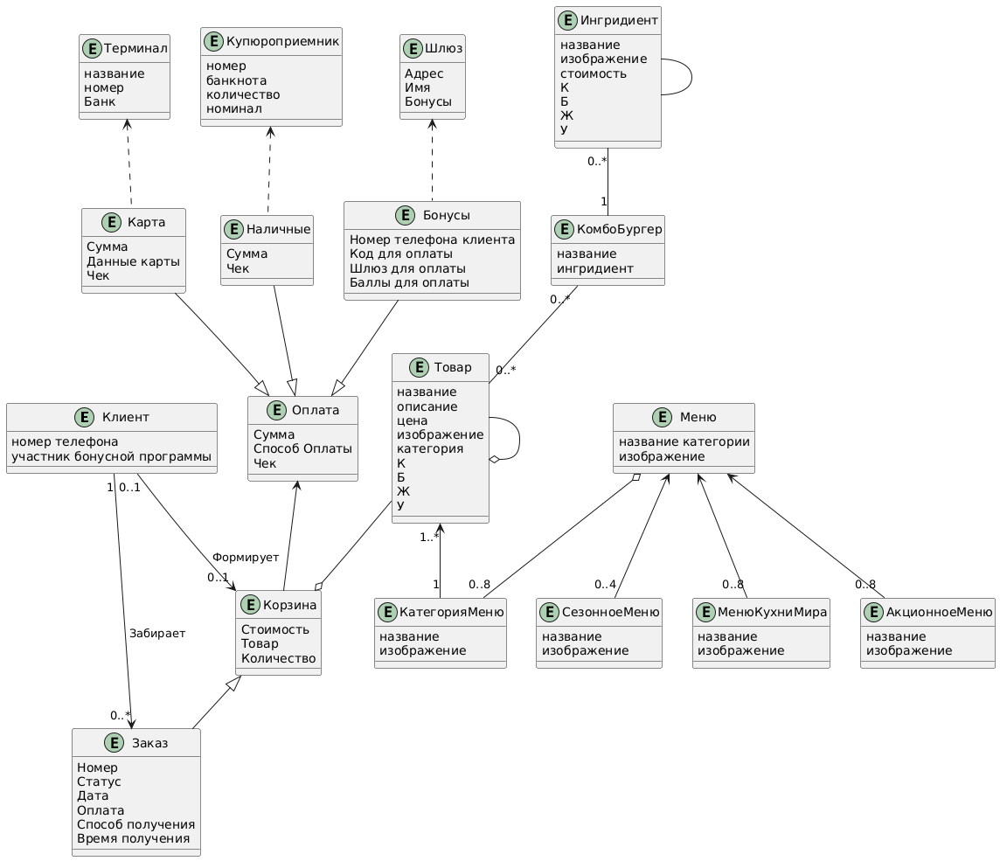
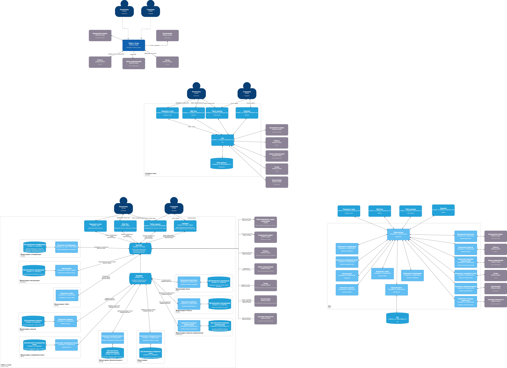
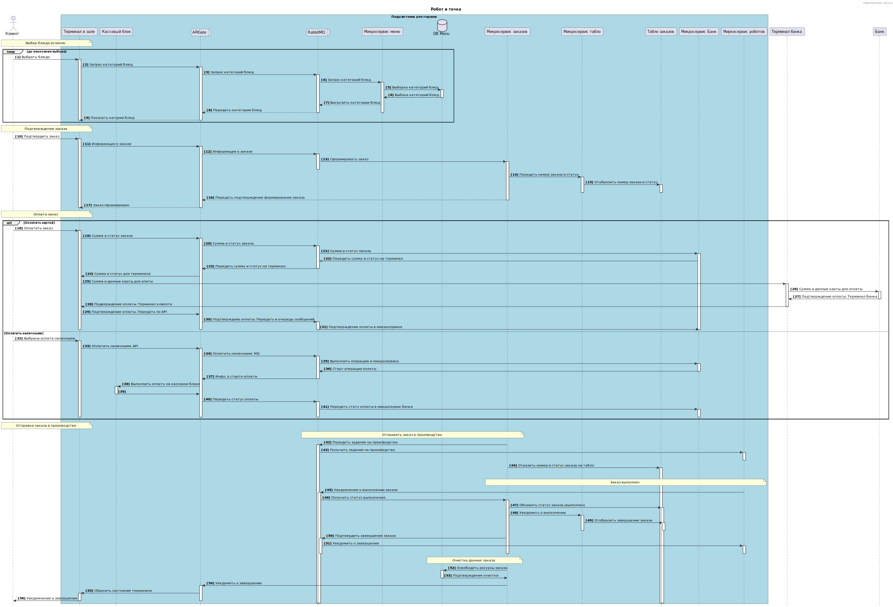
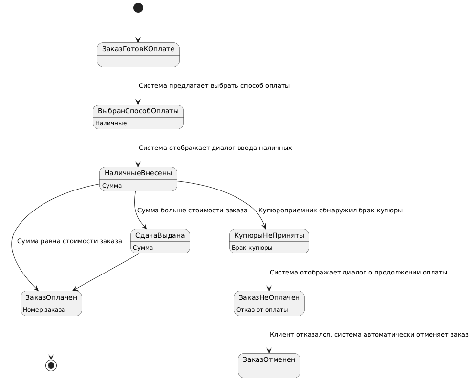

# Моделирование системы

## Логическая модель данных

Диаграмма отражает весь комплекс сущностей, участвующих в процессе, включая меню с сезонным фактором, корзину, состав товаров, систему лояльности, возмодности оплаты и др.

## Архитектура системы

Архитектурная диаграмма отражаеи все компоненты системы. За границей контура системы находятся компоненты с которыми система интегрирована для осуществления функци оплаты, складского хранения, уведомления, работы в рамках лояльности и проч.

## Связи и последовательность работы

Связь и взаимодействие компонентов системы продемонстирована на рисунке ниже. Зеленым цветом обозначены логические границы системы
 

## Оплата заказа. Состояния и переходы

