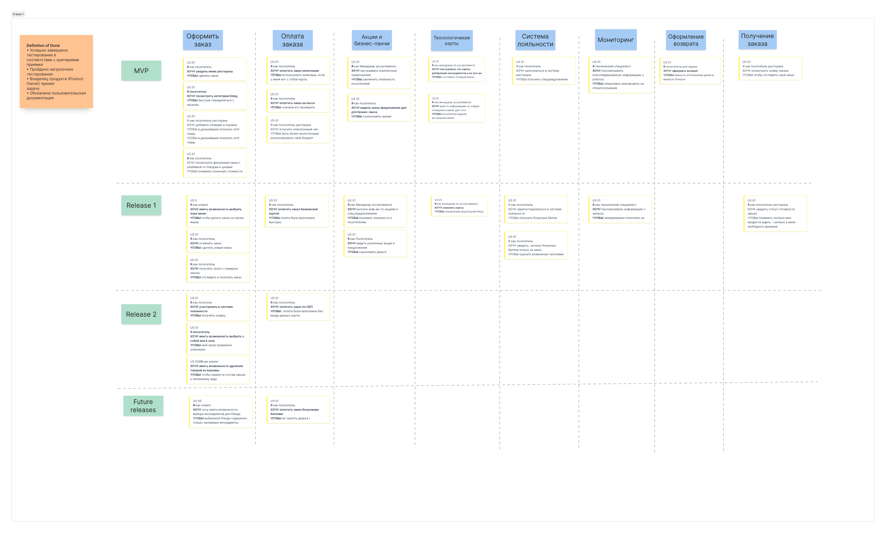

# Требования к системе

## Варианты использования

## Сценарий оформления заказа

**Вариант использования:**   
**«Оформление заказа»**

**Описание варианта использования (назначение):**  
Оформление заказа.

**Предусловия:**

1. На терминале открыта главная страница (стартовая страница заказа)  
2. Канал связи стабилен для обмена данными с мастер-системой.  
3. Открыт торговый день  
   

**Постусловия:**

1. Распечатан талон с номером заказа  
2. Номер заказа отображен в очереди заказов на табло в зале.  
3. Заказ передан в обработку на линию приготовления.  
   

**Основной поток:**

1. Пользователь выбирает категорию блюд  
2. Система отображает блюда в данной категории  
3. Пользователь выбирает конкретное блюдо  
4. Система открывает карточку блюда, предлагая выбор: добавить в корзину, вернуться назад  
5. Пользователь выбирает «Добавить в корзину»  
6. Система добавляет блюдо в корзину и отображает список товаров данной категории и предлагает «Возврат на главный экран» или «Перейти к оплате»  
7. Пользователь выбирает «перейти к оплате»  
8. Система отображает полный список товаров в корзине и варианты «Выбрать товар», «Перейти к оплате»  
9. Пользователь выбирает «Перейти к оплате»  
10. Система проверяет соответствие заказа условиям акции  
11. Система предлагает акционный товар в соответствии с условиями акции  
12. Система предлагает акционный товар и варианты «Согласиться», «Отказаться»  
13. Пользователь нажимает «Согласиться»  
14. Система добавляет товар в корзину  
15. Система проверяет, что заказ на сумму 1500 рублей или больше или это специальное комбо.  
16. Система предлагает покупателю фирменный стакан “Робот и точка”  
17. Система проверяет, что сегодня будний день и время заказа в интервале 10-16.  
18. Система предлагает цену со скидкой, как за бизнес-ланч.  
19. Система проверяет, пользуется ли посетитель системой лояльности.  
20. Система проверяет наличие баллов у посетителя.  
21. Система предлагает списать баллы.  
22. Система рассчитывает итоговую сумму.  
23. Система предлагает оплатить покупку.  
24. Пользователь выбирает оплатить.  
25. Система запускает оплату покупки.

Альтернативный поток:

**15.a. Заказ на сумму более 1500 рублей или это специальное комбо**  
1. Заказ на сумму менее 15000 рублей или это не специальное комбо  
2. Система переходит к шагу 17

**16.а. Система проверяет что сегодня будний день и время заказа в интервале 10-16**  
1. Система определяет, что сегодня не будний день  
2. Система переходит к шагу 19

**16.b. Система проверяет что сегодня будний день и время заказа в интервале 10-16**  
1. Система определяет, что время заказа не соответствует интервалу 10-16  
2. Система переходит к шагу 19

**19.a. Система проверяет пользуется ли посетитель системой лояльности**  
1. Система определяет, что посетитель не пользуется системой лояльности  
2. Система предлагает пользователю зарегистрироваться в системе лояльности  
3. Пользователь регистрируется в системе лояльности  
4. Система переходит к шагу 22

Исключения:

**Связь с сервером прервана**

1. Система сохраняет локально на терминале пользователя внесенные изменения и отображает сообщение, что дальнейшая работа невозможна из\-за потери связи с сервером

**Прерывание процесса:**

1. Система позволяет на каждом шаге вернуться к предыдущему шагу.  
2. Система на любом шаге позволяет завершить процесс.

Дополнительная функции (связанные use case):

1. Система позволяет пользователю количество накопленных баллов в системе лояльности.

## User stories для разработки
Прользовательските истории и маппинг пользовательстких историй для разработки

